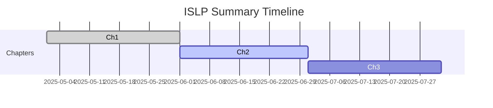

# ISLP Summary 📚

[](https://github.com/<your-github-username>) 
[](LICENSE)

> **Welcome to my personalised summary of *Introduction to Statistical Learning with Python (ISLP)!*** 
> You might notice that the content is rather sparse—sorry \:v

<details>
<summary>Table of Contents (click to expand)</summary>

* [Overview](#overview)
* [Why this repo?](#why-this-repo)
* [Current Progress](#current-progress)
* [Getting Started](#getting-started)
* [Contributing](#contributing)
* [Roadmap](#roadmap)
* [Credits](#credits)
* [License](#license)

</details>

## Overview

A hands‑on companion to the book *An Introduction to Statistical Learning with Applications in Python* (James et al., 2023). Expect annotated notebooks, mini‑projects, and code snippets that highlight key concepts.

## Why this repo?

Learning by writing is powerful. These notes are my way of solidifying concepts and sharing them with others. Feel free to reuse or contribute!

## Current Progress

* [x] Skeleton README
* [ ] Chapter 1 – Statistical Learning
* [ ] Chapter 2 – Linear Regression
* [ ] Chapter 3 – Classification
* [ ] Chapter 4 – Resampling Methods
* [ ] Chapter 5 – Linear Model Selection & Regularisation
* [ ] Chapter 6 – Non‑linear Models
* [ ] Chapter 7 – Tree‑Based Methods
* [ ] Chapter 8 – Support Vector Machines
* [ ] Chapter 9 – Unsupervised Learning
* [ ] Applied Projects & Notes

## Getting Started

```bash
# Clone the repo
git clone https://github.com/<your-github-username>/islp-summary.git
cd islp-summary

# Launch notebooks (option 1: local)
pip install -r requirements.txt
jupyter lab
```

[](https://mybinder.org/v2/gh/<your-github-username>/islp-summary/HEAD)

<details>
<summary>Need help running the notebooks?</summary>
GitHub can render notebooks directly, but for an interactive session you can either run them locally or click the Binder button above (no installation needed).
</details>

## Contributing

Spotted a typo or want to add your own notes? PRs are welcome! ✌️

<details>
<summary>Contributor Guide (click to expand)</summary>

1. Fork the repo
2. Create a feature branch: `git checkout -b feat/ch2-notes`
3. Commit changes and push
4. Open a pull request

</details>

## Roadmap



## Credits

Based on *An Introduction to Statistical Learning with Applications in Python* by Gareth James, Daniela Witten, Trevor Hastie & Robert Tibshirani.


